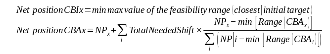
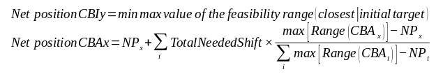

# Base Case Improvement
This page describes how the shifts to apply to active bidding zones are calculated if there are inactive bidding zones.

What inactive means is that, for this zone, the initial CE target NP was outside the feasibility ranges. Therefore, its CE NP is fixed to the min or max value defined in its feasibility range.

In contrast, active bidding zones participate in the compensation because their initial CE target NP was inside the feasibility range.

Given :
- $NPx$: Initial CE NP,
- $NeededShift$: The difference between the target NP and the feasibility ranges max/min (whichever is closer to NP),
- $CBA/CBI$: Active/Inactive bidding zone,

The new target CE NPs calculation depends on the sum of $NeededShift$ for inactive zones :
- if it is negative,

- if it is positive :

For the inactive bidding zones, the NPs will be shifted to the max/min of the feasibility range using the real merged GLSK.

The remaining difference between target NP and reference NP is being distributed over the active CE bidding zones, to their newly calculated CE NP using the GLSK.
